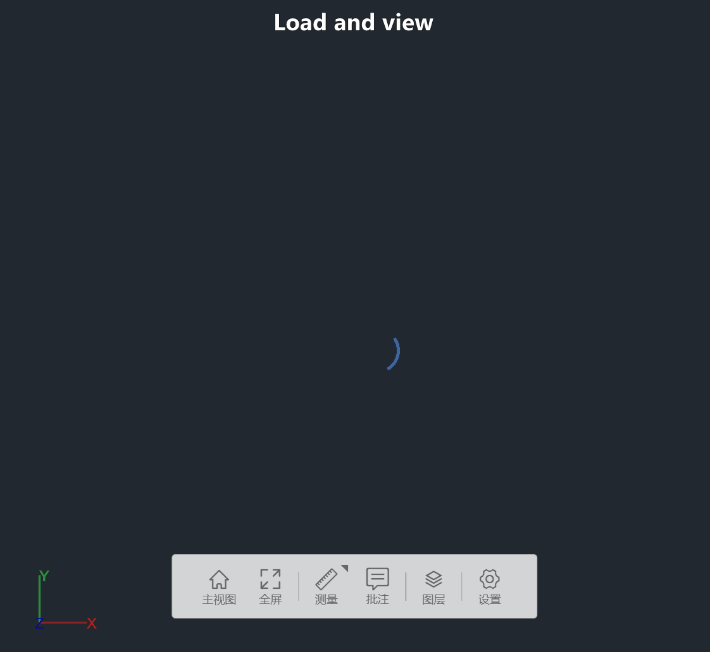
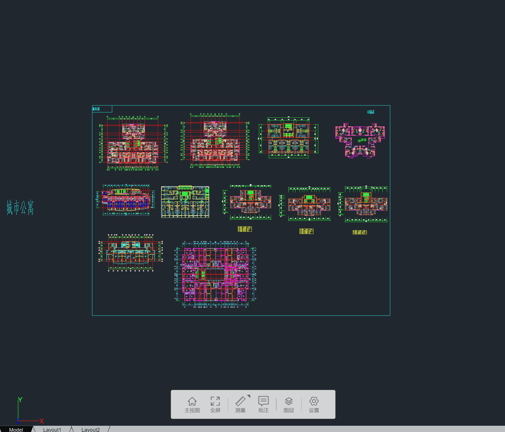
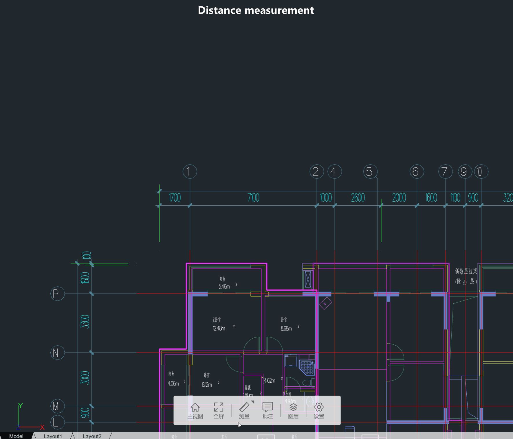
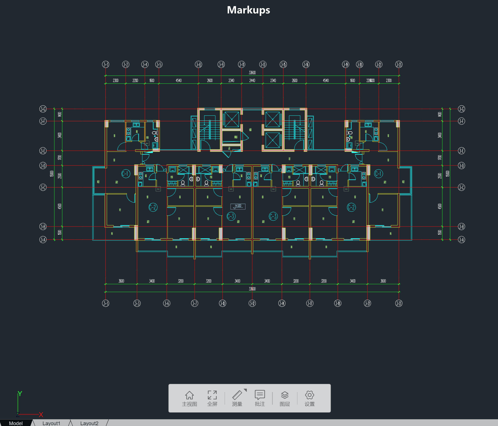
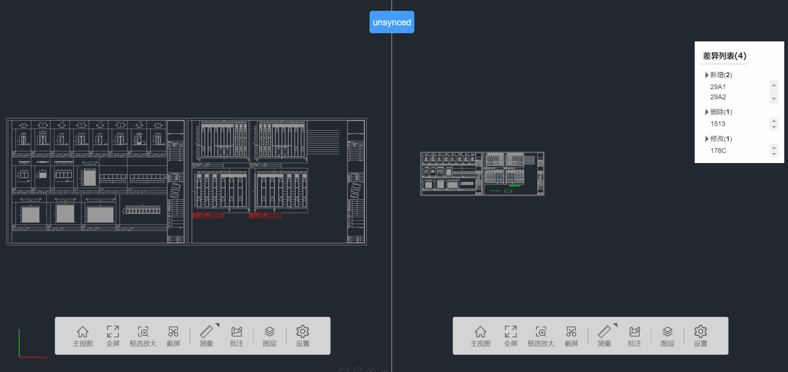
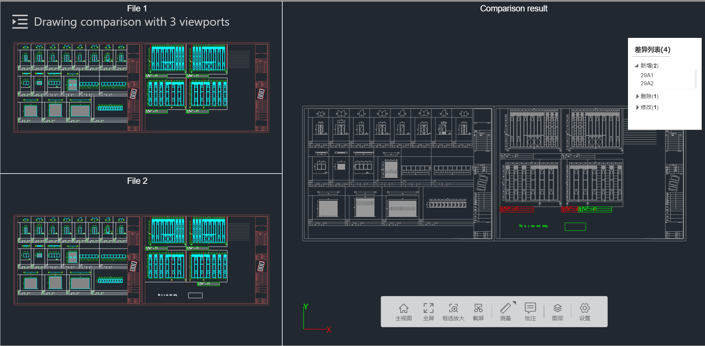

## dxf-viewer-examples

Examples showing how to view **2D DXF/DWG drawings** in the browser using the `@x-viewer/core` 2D viewer engine (WebGL/Three.js based).

- **Online demos**: [Online examples](https://dxf.thingraph.site/)

## Run examples

```bash
npm install
npm start
```

The dev server will start and you can open the examples in your browser.

---

## About @x-viewer/core

The examples in this repo are built on top of `@x-viewer/core`, focusing on the **Viewer2d** for DXF/DWG drawings.  
It includes DXF/DWG parsing and 2D rendering, layer control, layouts, measurements, markups and other utilities for building 2D drawing applications.

### Features

- High-performance 2D rendering: WebGL-based rendering engine built on Three.js
- DXF/DWG support: Parse and render DXF/DWG files entirely in the browser without backend server
- Rich 2D tools: layers, layouts, osnaps, distance/area/angle measurements, markups, comparison, screenshots, etc.
- Modular architecture: Designed for extensibility and seamless integration
- TypeScript: Full TypeScript support with comprehensive type definitions

### Install @x-viewer/core (use in your own project)

```bash
npm install @x-viewer/core
# or
pnpm add @x-viewer/core
# or
yarn add @x-viewer/core
```

### Quick Start – Viewer2d (DXF/DWG Viewer)

```typescript
import { Viewer2d } from "@x-viewer/core";

// Create a 2D viewer
const viewerCfg = {
    containerId: "myCanvas",
    enableSpinner: true,
    enableLayoutBar: true,
};

const modelCfg = {
    modelId: "id_0",
    name: "sample",
    src: "http://www.abc.com/sample.dxf",
}
const fontFiles = ["http://www.abc.com/hztxt.shx", "http://www.abc.com/simplex.shx"];

const viewer = new Viewer2d(viewerCfg);
await viewer.setFont(fontFiles);
await viewer.loadModel(modelCfg, (event) => {
    const progress = (event.loaded * 100) / event.total;
    console.log(`${event.type}: ${progress}%`);
});
console.log("Loaded");
viewer.goToHomeView();
```

### Features
- Viewer2d features includes: load and view one or more dxf files, basic mouse/key operations, layouts, layers, distance/area/angle measurements with osnaps, markups, hotpoints, comparison, undo/redo for measurements/markups, zoom to selected area, screenshots, set background color, etc.
- Supported entity types includes: POINT, 3DFACE, ARC, ATTDEF, ATTRIB, CIRCLE, DIMENSION, MLEADER, MULTILEADER, ELLIPSE, HATCH, INSERT, LEADER, LINE, LWPOLYLINE, MTEXT, RAY, POLYLINE, SOLID, SPLINE, TEXT, VERTEX, VIEWPORT, XLINE, etc. IMAGE, OLE2FRAME, REGION are partially supported.

- Load and view dxf file

- Switch between layouts

- Distance measurement

- Area measurement
- Angle measurement
- Markups

- Comparison


- Undo/redo

### Limitations
- It doesn't support complex linetypes, e.g., linetype with text in it.
- It uses line geometries to represent texts rather than mesh, for a better performance.
- It doesn't support polyline with different start and end width.
- It doesn't support Tangent CAD, need to export to T3 format first.
- It supports dxf version "AutoCAD 2018", other versions are not well tested.


## Licensing

### Personal Usage
- **Free**: The software is available for free for personal, non-commercial use. This includes use by individuals for their own projects, hobbies, or learning purposes.

### Commercial Usage
- **$1,000**: For commercial use, where the software is used in a business context to generate revenue or for professional purposes. This includes use by companies, organizations, or individuals in a commercial setting.

### Source Code Access
- **$15,000**: For access to the full source code of the software. This option is for users who need to modify the source code for their specific needs, integrate it into their own products, or require the source code for other reasons.

### Contact Us
- For any inquiries or support, please contact us at [thingraph@outlook.com](mailto:thingraph@outlook.com).

---

## Related Packages

- `@x-viewer/core` – Core viewer engine (2D/3D)
- `@x-viewer/plugins` – Extensible functionality modules
- `@x-viewer/ui` – Reusable UI components
